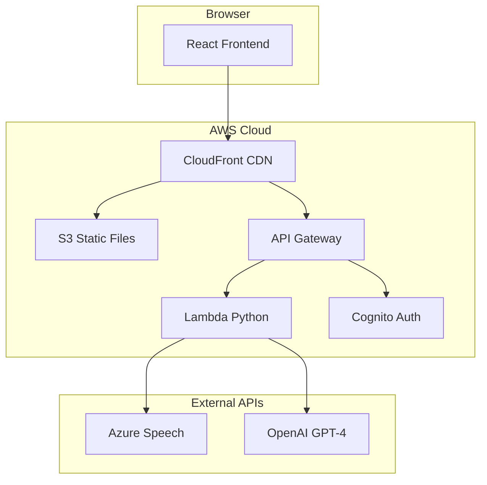

# AI Accent Coach

A web app to improve English pronunciation using AI-powered feedback. Records your voice, analyzes pronunciation with Azure Speech Services, and provides coaching tips via OpenAI GPT-4.

## Architecture



**Key points:**
- Frontend is a React SPA served via CloudFront/S3
- Backend is a FastAPI app running on Lambda (containerized)
- Authentication via AWS Cognito (invite-only, no self-registration)
- All API calls require authentication to protect Azure/OpenAI usage

## Local Development

### Prerequisites

- Python 3.11+
- Node.js 18+
- ffmpeg (`brew install ffmpeg` on macOS)

### Quick Start

```bash
# One-time setup (installs dependencies, creates .env template)
./setup.sh

# Start both servers
./start.sh
```

Open http://localhost:5173

### API Keys

Edit `backend/.env` with your keys (created by setup.sh):
```
AZURE_SPEECH_KEY=your-key
AZURE_SPEECH_REGION=eastus
OPENAI_API_KEY=sk-your-key
```

The app works without keys in **demo mode** (returns mock scores).

## Deployment

See [docs/FIRST_TIME_SETUP.md](docs/FIRST_TIME_SETUP.md) for initial AWS deployment.

See [docs/DEPLOYMENT.md](docs/DEPLOYMENT.md) for regular deployments.

## Project Structure

```
├── backend/           # FastAPI backend
│   ├── main.py        # API endpoints
│   ├── grading_engine.py   # Azure Speech integration
│   ├── coaching_engine.py  # OpenAI integration
│   └── Dockerfile     # Lambda container
├── frontend/          # React frontend
│   └── src/
│       ├── App.tsx    # Main component
│       ├── auth/      # Cognito auth
│       └── components/
├── infrastructure/    # Terraform AWS config
└── docs/              # Deployment guides
```

## License

See [LICENSE](LICENSE).
